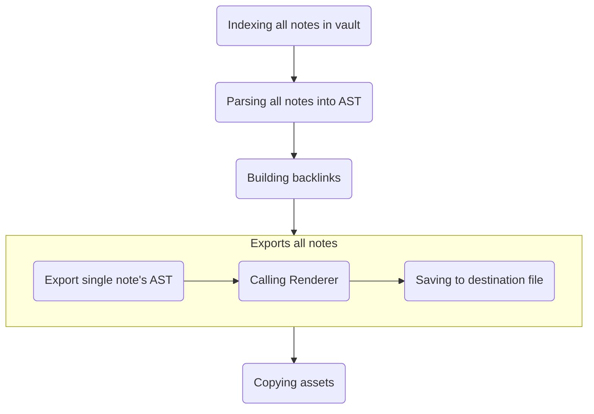

## dendron-exports

This tools allow you to export your Dendron vault into SSG-compatible Markdown.

This will convert below:

```md
![[anoter-note#first]]

[[anoter-note#second]]
```

into:

```md


## First

This is first header



[Anoter Note](/notes/mnj7u1ez5wxg5v5kok8j79u#second)
```

Current supported SSG:

- Lume with Nunjuck. Example template [dendron-lume by levirs565](https://github.com/levirs565/dendron-lume)

Supported Dendron feature:

- Ref
- Wikilink

## Getting Started

Make sure you have installed [Deno](https://deno.land/).

First, create `deno.json` in your Dendron root directory and write this code:

```json
{
  "tasks": {
    "dendron_exports": "echo \"import 'dendron_exports/cli.ts'\" | deno run -A -"
  },
  "imports": {
    "dendron_exports/": "https://deno.land/x/dendron_exports@v0.1.1/"
  }
}
```

Then, create `dendron-exports.config.ts` in same directory as the previous file and write this code:

```ts
import { LumeNjkRenderer, Options } from "dendron_exports/mod.ts";

export const options: Options = {
  baseDir: "./",
  vaultPath: "vault",
  vaultName: "vault",
  noteDest: ".exports",
  notePathBuilder: (note) =>
    note.getPath() === "root" ? "index" : "notes/" + note.metadata.id,
  noteRenderer: new LumeNjkRenderer(),
};
```

Then run this command:

```sh
deno task dendron_exports
```

After that, your notes will exported into `.exports` directory.

## How it Work?

This diagram show how this program work:



This program use [micromark](https://github.com/micromark/micromark) and [mdast-util-from-markdown](https://github.com/syntax-tree/mdast-util-from-markdown) to parse Markdown into AST.

### What is Renderer?

Renderer is class that have responsibility to convert AST into SSG-compatible markdown. Renderer use [mdast-util-to-markdown](https://github.com/syntax-tree/mdast-util-to-markdown/) to convert AST back into markdown.

## Creating Custom Renderer

You can create custom renderer by extending `RendererClass`.

#### Example Case: Hugo Renderer

Hugo support [shortcodes](https://gohugo.io/content-management/shortcodes/) to create custom widget in Markdown. We can use this to render ref and block anchor. To render wikilink we just convert it into standard Markdown link.

To start creating Renderer, create `HugoRenderer` class that extends `Renderer`.

```ts
import { Renderer } from "dendron_exports/mod.ts";

class HugoRenderer extends Renderer {}
```

We can convert ref into shortcode like this:

```html
 content 
```

To convert ref into shortcode like that we can implement `getRefText` like this:

```ts
import { Renderer, RendererRefContext } from "dendron_exports/mod.ts";

class HugoRenderer extends Renderer {
  getRefText(ref: RendererRefContext): string {
    const header = `{{< ref targetId="${
      ref.targetNote!.metadata.id
    }" targetTitle="${ref.targetNote!.metadata.title}" targetUrl="${
      ref.targetUrl
    }">}}`;
    const footer = ``;
    return [header, ref.content, footer].join("\n");
  }
}
```

We can convert block anchor into shortcode like this:

```html

```

To convert ref into shortcode like that we can implement `getBlockAnchorText` like this:

```ts
class HugoRenderer extends Renderer {
  getBlockAnchorText(name: string): string {
    return `{{< anchor name="${name}" >}}`;
  }
}
```

For WikiLink handling, implement `getWikiLinkText` like this:

```ts
class HugoRenderer extends Renderer {
  getWikiLinkText(url: string, title: string): string {
    return `[${title}](${url})`;
  }
}
```

Final `HugoRenderer` class code:

```ts
import { Renderer, RendererRefContext } from "dendron_exports/mod.ts";

class HugoRenderer extends Renderer {
  getRefText(ref: RendererRefContext): string {
    const header = `{{< ref targetId="${
      ref.targetNote!.metadata.id
    }" targetTitle="${ref.targetNote!.metadata.title}" targetUrl="${
      ref.targetUrl
    }">}}`;
    const footer = ``;
    return [header, ref.content, footer].join("\n");
  }

  getBlockAnchorText(name: string): string {
    return `{{< anchor name="${name}" >}}`;
  }

  getWikiLinkText(url: string, title: string): string {
    return `[${title}](${url})`;
  }
}
```

Now we can use the renderer in config by changing `noteRenderer` options like this:

```ts
export const options: Options = {
  // another config
  noteRenderer: new HugoRenderer(),
};
```

This renderer will convert below:

```md
![[anoter-note#first]]

[[anoter-note#second]]
```

into:

```md


## First

This is first header



[Anoter Note](/notes/mnj7u1ez5wxg5v5kok8j79u#second)
```
